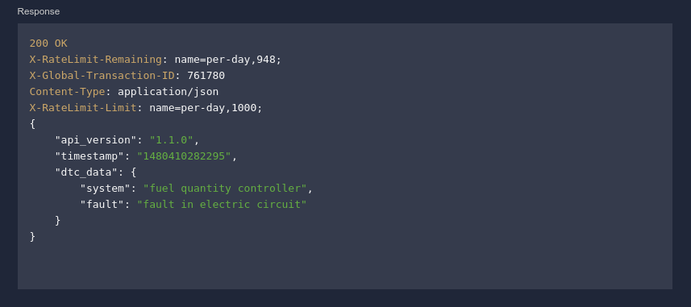
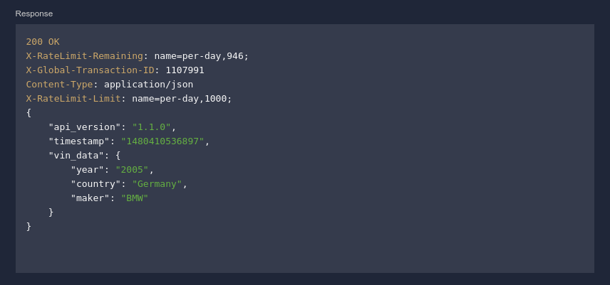

# Car Diagnostic API - Documentation

## 1. Overview
This API can help you to assess the health status of a vehicle, by translating
OBD error codes in a human readable form.This service is of great interest for
various companies, e.g., IoT/Automotive startups, fleet management providers,
booking platforms and taxi companies. We support all error codes that can be
read with the widely used ELM327 OBD dongles. In addition to that, we also
support error codes that are specific to car manufacturers. Our database
includes more than 17.000 error codes that are professionally maintained.
The API can be accessed via IBM Bluemix - you can get access to it under the following link:

https://console.eu-gb.bluemix.net/catalog/services/car-diagnostic-api/

Apart from the API itself, we will also provide iOS and Android Example Apps
for developers, which explains the API usage and includes additional convenience
features like establishing a bluetooth connection between the smartphone and the
OBD dongle, determining the correct OBD protocol and requesting error codes from
the car. These Apps are available under the following links:

- [iOS OBD Example App](https://github.com/HellaVentures/iOS-OBD-Example-App)
- [Android OBD Example App](https://github.com/HellaVentures/Android-OBD-Example-App)

## 2. Features

The API is built in a Restful way and returns JSON objects as a response. Input
parameters are passed to the API inside the URI. This API provides two main
features:

- Diagnostic Trouble Code (DTC) translation
- Vehicle Identification Number (VIN) decoding.

The DTC translation is available on the `/dtc` endpoint. As an input you need to
provide the 5-digit error code as it is returned from the OBD dongle (e.g.
P0001), the first 11 digits of the VIN and a language (EN or DE). As an output
you get the system in the car where the error is located and a description of
the fault. An example call to this endpoint can be seen in the following figure.

A list of all supported car makers is available on the `/dtc/maker` endpoint and
a list of all supported languages can be seen on the `/dtc/langs` endpoint.

The VIN decoding is available on the `/vin` endpoint. As an input you need to
provide the first 11 digits of the VIN. As an output you get the car maker, the
country code, the production year and the plant. An example call to this
endpoint can be seen in following figure.

TODO: reference swagger documentation

## 3. Usage

- how to sign up to API usage (tokens etc.)
- usage models (free, paid)

## 4. Feedback and Support

- where to file issues and feature requests about the API
- where to file issues and feature requests about the Apps
